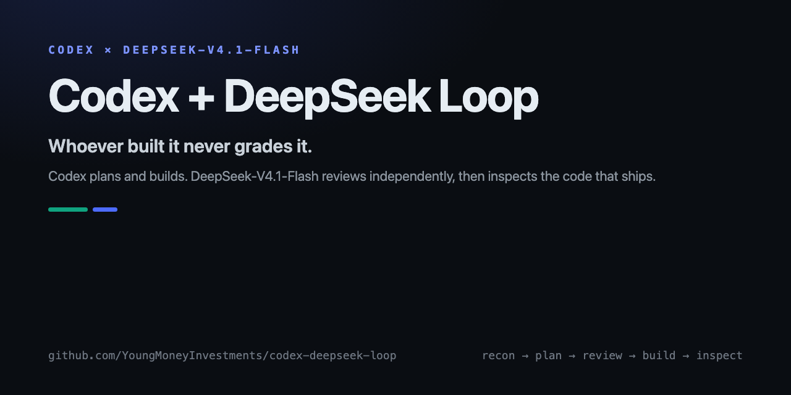
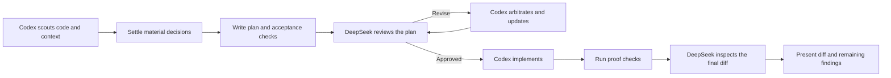

<div align="center">

# Codex + DeepSeek Loop

### Four-phase plan hardening for Codex (the ChatGPT coding agent), with DeepSeek-V4.1-Flash as the independent reviewer.

[](./LICENSE)
[](https://github.com/YoungMoneyInvestments/codex-deepseek-loop/actions/workflows/tests.yml)
[](skills/deepseek-loop/references/runtime.md)



</div>

Codex plans, builds and coordinates in your own session. **DeepSeek-V4.1-Flash** (open weights, MIT, ~221 tokens/second, $0.15 / $0.60 per million tokens off-peak) adversarially reviews the plan before code exists, then independently inspects the final diff. The model that built it never grades it — and the grading seat costs about **1/40th to 1/70th of a frontier reviewer** ([benchmarks and cost math](BENCHMARKS.md)).

In a direct 48-job synthetic comparison against YMI's Claudex adaptation, automated one-to-one scoring credited both loops with all 39 seeded defects. Claudex led the composite quality score by 2.13 points, clearing the preregistered threshold; DeepSeek returned the expected verdict on every run and had 36% lower median latency. [Read the evidence and limits.](BENCHMARKS.md#direct-loop-reviewer-benchmark)

> Sibling repository: **[claude-deepseek-loop](https://github.com/YoungMoneyInvestments/claude-deepseek-loop)** — the same loop for hosts that run in Claude Code.

## Why DeepSeek in the reviewer seat

- **The reviewer's job maps onto DeepSeek's strongest public profile.** On the agentic-coding evaluations that proxy code review — Terminal-Bench 2.1 (90.6 vs Opus-5.0's 89.1 and GPT-5.6 Sol's 88.8), DeepSWE v1.1 (74.2 vs 74.0 / 73.0), AutomationBench (54.8 vs 50.3 / 45.8), Agent's Last Exam (31.8 vs 28.6 / 26.7) — V4.1-Flash is at parity with, or ahead of, the frontier flagships you would otherwise pay for. Full table with sources in [BENCHMARKS.md](BENCHMARKS.md).
- **Rounds are nearly free, so you get more of them.** At $0.15/$0.60 per Mtok (off-peak) a full two-round review plus a final inspection costs **≈ $0.05–$0.09**. The same loop on a $10/$50 frontier API runs ≈ $3.35. Cheap scrutiny beats a single expensive pass.
- **Fast enough to sit inside an interactive loop.** 221 tok/s on DeepSeek's API (~3.2× Claude Fable 5.1's 69 tok/s) means a full review returns in about two minutes, not six.
- **The host adjudicates everything.** Findings are proposals: the host implements what's warranted, rejects the rest with reasons, and proof commands stay the source of truth. A reviewer disagreement is bounded by the loop, not by the reviewer.

## How the loop works



| | Requirements and plan | Plan reviewer | Default builder | Final inspector |
|---|---|---|---|---|
| **Codex** | Current Codex session | DeepSeek-V4.1-Flash | Codex | DeepSeek-V4.1-Flash (fresh run) |
| **Claude Code** | Current Claude session | DeepSeek-V4.1-Flash | Claude | DeepSeek-V4.1-Flash (fresh run) |

One skill serves both hosts (it detects which one it is running inside); this repository is the Codex distribution. The reviewer runs through the DeepSeek API — standard-library Python, no packages, no second coding CLI, no second subscription.

A plan review is bound to the plan's SHA256; an inspection is bound to the exact change manifest (tracked, untracked and deleted files) of the final code. Change either and the approval is invalid — the runner fails closed.

## Install

**Requirements:** Python 3.9+, `git`, and a `DEEPSEEK_API_KEY` ([platform.deepseek.com](https://platform.deepseek.com)).

### Manual skill installation (recommended)

```bash
git clone https://github.com/YoungMoneyInvestments/codex-deepseek-loop
mkdir -p ~/.agents/skills
cp -R codex-deepseek-loop/skills/deepseek-loop ~/.agents/skills/
export DEEPSEEK_API_KEY=sk-...   # in the shell that launches Codex
```

Open a new session and invoke `$deepseek-loop`. A `.codex-plugin/plugin.json` is included for Codex plugin packaging; manual installation above does not require adding a marketplace. See [runtime.md](skills/deepseek-loop/references/runtime.md) for details, security notes and limits.

## Use

```text
$deepseek-loop this feature — plan and implement it
$deepseek-loop this plan, mode=review, plan=docs/migration.md, rounds=3
$deepseek-loop add the CSV export, effort=max
```

The loop also works as two standalone commands:

```bash
python3 ~/.agents/skills/deepseek-loop/scripts/deepseek_review.py review \
  --host codex --repo "$PWD" --plan PLAN.md --context src/core.py
python3 ~/.agents/skills/deepseek-loop/scripts/deepseek_review.py inspect \
  --host codex --repo "$PWD" --plan PLAN.md --base <pre-build-commit>
```

The reviewer has **no repository access**: it sees the plan, the change manifest, the diff, new-file contents, and any `--context` files you pass. That is both the quality boundary and the security boundary.

## What an approval means

- Approval is bound to the exact plan path and SHA256 (reviews) or the exact change manifest (inspections). Later edits invalidate it.
- A clean structured verdict does not prove the model is right. The log preserves coverage, limitations and evidence; the host evaluates them.
- Zero findings is valid; a large number of findings is not a quality score. `BLOCKED`, failed runs and exhausted round budgets are surfaced, never converted into approval.
- DeepSeek cannot run your tests. Proof commands run in the host session and their output is the evidence.

## Controls

| Argument | Default | Purpose |
|---|---|---|
| `plan` / `PLAN_FILE` | `PLAN.md` | Plan path used throughout |
| `log` / `LOG_FILE` | `PLAN-REVIEW-LOG.md` | Append-only transcript of findings, dispositions and costs |
| `rounds` / `MAX_ROUNDS` | `3` | Completed plan-review round cap |
| `effort` | `high` | DeepSeek thinking effort (`low`, `high`, `max`, `none`) |
| `model` | `deepseek-flash` | Reviewer model (`deepseek-flash` or `deepseek-v4-pro`) |
| `MAX_FIX_ROUNDS` | `2` | Build-fix attempts before reporting or taking over |
| `MAX_INSPECTION_ROUNDS` | `2` | Initial inspection plus one after accepted fixes |
| `inspect` | `on` | `off` is an explicit, logged opt-out |

Every run prints token usage and a USD cost estimate (off-peak and peak) and stores its full artifacts — prompt, response, reasoning, diff, result — in a run directory outside your checkout.

## Development and verification

```text
python3 scripts/validate.py
python3 -m unittest discover -s tests -v
```

The contract suite (25 tests) covers role resolution, retry and parse-retry behavior, fail-closed schema validation, HTTP error handling, approval binding, change-manifest coverage, mid-run mutation detection, prompt caps, artifacts isolation, and both CLI hosts. Tests use a local mock API and disposable Git repositories — no network, no model quota. CI runs on Linux, macOS and Windows on Python 3.11 and 3.13.

## Credits

The four-phase structure, structured review schema, plan-hash approval binding and change-manifest patterns are adapted from [claudex-loop](https://github.com/chaseai-yt/claudex-loop) by Chase AI (MIT), with the second coding CLI replaced by the DeepSeek API. See [ACKNOWLEDGMENTS.md](ACKNOWLEDGMENTS.md) and [LICENSE](LICENSE).
